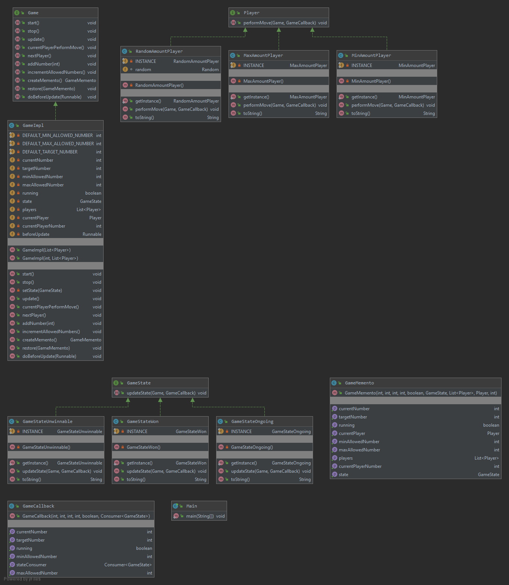

# Object oriented design patterns assignment

## Description

This program implements a game with the following rules:
1. A target number is assigned, the current number is initialized to 0,
   and the minimum and maximum allowed increases are initialized to 0 and 10,
   respectively.
2. On their turn, each player can increase the current number by a value
   between the minimum and maximum increase. The minimum and maximum increases
   are incremented by 1.
3. If the number matches the target number, the current player wins. If it exceeds
   the target number, the game becomes unwinnable.

The program implements three types of player logic:
1. Chooses the minimum possible increase or the winning increase.
2. Chooses the maximum possible increase or the winning increase.
3. Chooses a random increase between the minimum and maximum, or the winning increase.

## Used patterns

### Decorator
Used for `GameDecorator` to create mementos of the current state of the `Game`
implementation before each player's turn.

### Memento
Used by the `Game` implementations to create representations of its' previous states.

### Singleton
Used for the `GameState` and `Player` implementations, as they are mostly stateless.

### State
Used by the `GameState` implementations to signify whether the game is
in progress, won, or unwinnable.

### Template method
Used for the `Player` implementations to use different logic of choosing an increase.

## Conclusions
The memento pattern is appropriate for this type or game, i.e. turn-based.

The game class could benefit from the builder pattern, if more of its' setting
were allowed to be customized.

The singleton pattern might not be appropriate for the
`Player` implementations, as they might need instance state,
which would cause problems with multithreading.

More template methods could be used, for instance, to have differing logic for
increasing the allowed values.

For the player classes it might be more appropriate to have them make use of
classes implementing the strategy pattern, rather than using the template method
pattern themselves. This would allow their logic to change on the fly.

## Class diagram
